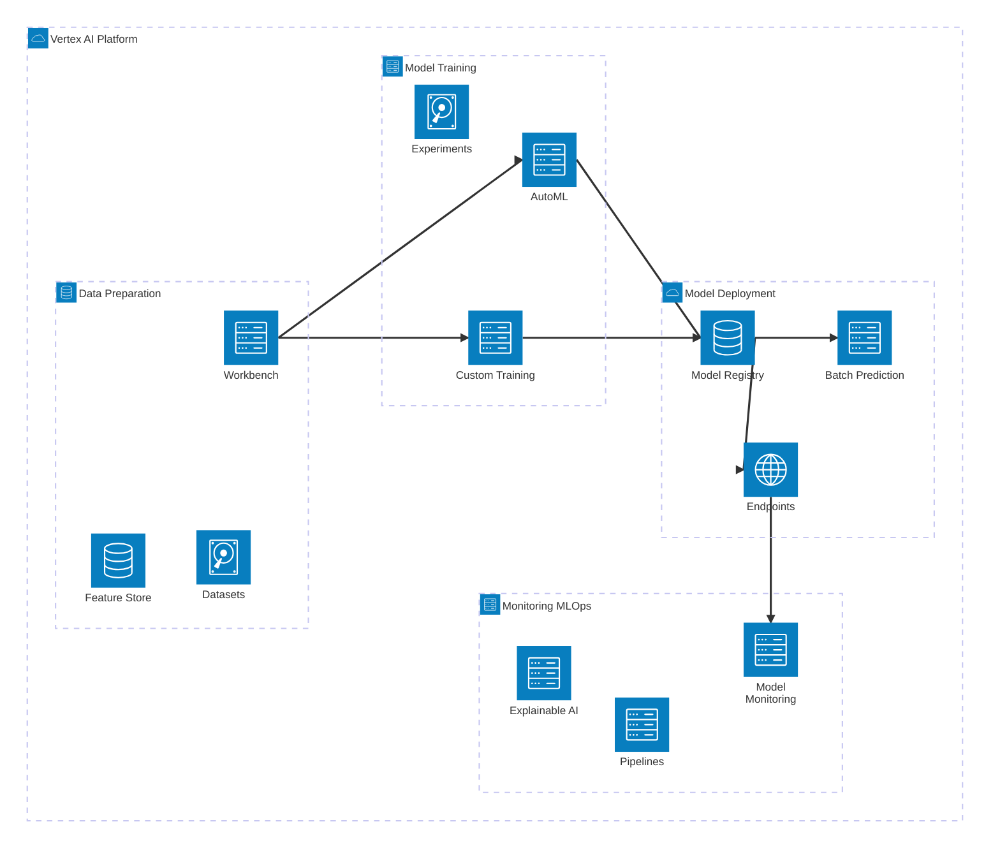
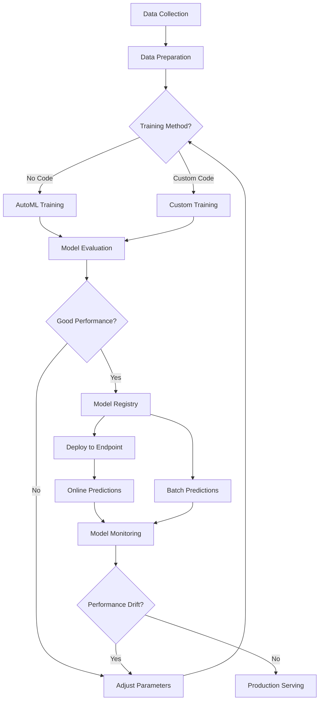
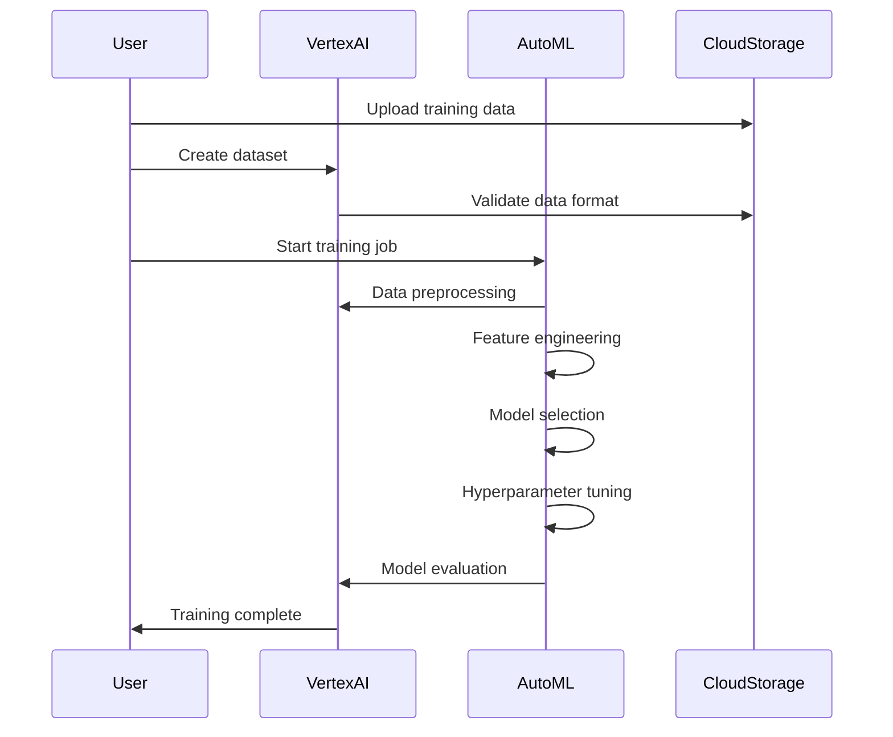
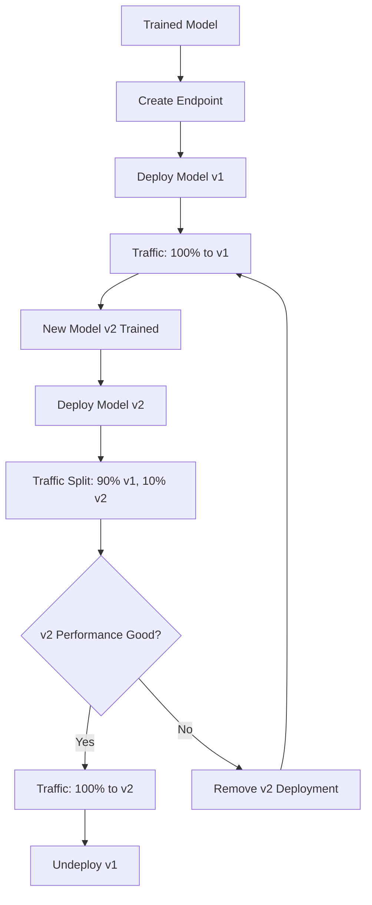
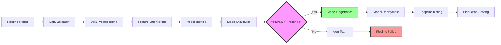
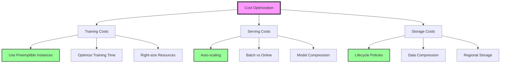

# GCP Vertex AI Crash Course: From Zero to ML Production

## Table of Contents

1. [Introduction to Vertex AI](#introduction)
2. [Vertex AI Architecture Overview](#architecture)
3. [Setting Up Your Environment](#setup)
4. [AutoML: No-Code Machine Learning](#automl)
5. [Custom Training](#custom-training)
6. [Model Deployment and Endpoints](#deployment)
7. [MLOps with Vertex AI Pipelines](#mlops)
8. [Generative AI and Model Garden](#genai)
9. [Monitoring and Management](#monitoring)
10. [Best Practices and Cost Optimization](#best-practices)
11. [Real-World Examples](#examples)

---

## 1. Introduction to Vertex AI {#introduction}

Vertex AI is Google Cloud's unified machine learning platform that combines data engineering, data science, and ML engineering workflows. It allows teams to collaborate using a common toolset and scale applications using Google Cloud's infrastructure.

### Key Features

- **Unified Platform**: Combines AutoML and custom training
- **Model Garden**: Access to pre-trained models and LLMs
- **MLOps Tools**: End-to-end workflow management
- **Generative AI**: Access to Gemini and other LLMs
- **Scalable Infrastructure**: Automatic scaling and optimization

### When to Use Vertex AI

- Building ML models without extensive coding (AutoML)
- Custom model training with full control
- Deploying models at scale
- Managing ML workflows and pipelines
- Implementing generative AI solutions

---

## 2. Vertex AI Architecture Overview {#architecture}



### ML Workflow in Vertex AI



---

## 3. Setting Up Your Environment {#setup}

### Prerequisites

- GCP Project with billing enabled
- Vertex AI API enabled
- Appropriate IAM permissions

### Step 1: Enable Vertex AI API

```bash
# Set your project ID
export PROJECT_ID="your-project-id"
export REGION="us-central1"

# Enable required APIs
gcloud services enable aiplatform.googleapis.com
gcloud services enable storage.googleapis.com
gcloud services enable bigquery.googleapis.com
```

### Step 2: Create Service Account

```bash
# Create service account
gcloud iam service-accounts create vertex-ai-service \
    --display-name="Vertex AI Service Account"

# Grant necessary permissions
gcloud projects add-iam-policy-binding $PROJECT_ID \
    --member="serviceAccount:vertex-ai-service@$PROJECT_ID.iam.gserviceaccount.com" \
    --role="roles/aiplatform.user"

# Download credentials
gcloud iam service-accounts keys create vertex-ai-key.json \
    --iam-account=vertex-ai-service@$PROJECT_ID.iam.gserviceaccount.com
```

### Step 3: Set Up Python Environment

```python
# Install required packages
pip install google-cloud-aiplatform pandas scikit-learn

# Initialize Vertex AI
from google.cloud import aiplatform

aiplatform.init(
    project="your-project-id",
    location="us-central1",
    staging_bucket="gs://your-bucket-name"
)
```

### Step 4: Create Storage Bucket

```bash
# Create bucket for storing data and models
gsutil mb -p $PROJECT_ID -l $REGION gs://$PROJECT_ID-vertex-ai
```

---

## 4. AutoML: No-Code Machine Learning {#automl}

AutoML enables you to train high-quality machine learning models without writing code. It supports tabular, image, text, and video data.

### 4.1 Tabular Data Classification Example

#### Scenario: Predicting Customer Churn

```python
from google.cloud import aiplatform
import pandas as pd

# Prepare sample data
data = {
    'customer_id': range(1000),
    'tenure_months': [12, 24, 6, 36, 48, 3] * 167,  # Simplified
    'monthly_charges': [50, 80, 35, 90, 120, 25] * 167,
    'total_charges': [600, 1920, 210, 3240, 5760, 75] * 167,
    'contract_type': ['month-to-month', 'one-year', 'two-year'] * 334,
    'churn': [1, 0, 1, 0, 0, 1] * 167  # Target variable
}

df = pd.DataFrame(data)
df.to_csv('customer_churn.csv', index=False)

# Upload to Cloud Storage
!gsutil cp customer_churn.csv gs://$PROJECT_ID-vertex-ai/data/
```

#### Create AutoML Dataset

```python
from google.cloud import aiplatform

# Create dataset
dataset = aiplatform.TabularDataset.create(
    display_name="customer_churn_dataset",
    gcs_source=["gs://your-bucket/data/customer_churn.csv"]
)

print(f"Dataset created: {dataset.resource_name}")
```

#### Train AutoML Model

```python
# Define training job
job = aiplatform.AutoMLTabularTrainingJob(
    display_name="customer_churn_automl",
    optimization_prediction_type="classification",
    optimization_objective="minimize-log-loss"
)

# Start training
model = job.run(
    dataset=dataset,
    target_column="churn",
    training_fraction_split=0.8,
    validation_fraction_split=0.1,
    test_fraction_split=0.1,
    budget_milli_node_hours=1000,  # 1 hour
    model_display_name="customer_churn_model",
    disable_early_stopping=False
)

print(f"Model trained: {model.resource_name}")
```

### 4.2 AutoML Training Process Flow



### 4.3 Image Classification Example

```python
# Create image dataset
image_dataset = aiplatform.ImageDataset.create(
    display_name="flower_classification",
    gcs_source=["gs://your-bucket/image_data/flowers.csv"],
    import_schema_uri=aiplatform.schema.dataset.ioformat.image.single_label_classification
)

# Train image classification model
image_job = aiplatform.AutoMLImageTrainingJob(
    display_name="flower_classification_automl",
    prediction_type="classification",
    multi_label=False,
    model_type="CLOUD",
    base_model=None
)

image_model = image_job.run(
    dataset=image_dataset,
    model_display_name="flower_classifier",
    training_fraction_split=0.8,
    validation_fraction_split=0.1,
    test_fraction_split=0.1,
    budget_milli_node_hours=8000,  # 8 hours
)
```

---

## 5. Custom Training {#custom-training}

Custom training gives you complete control over the training process, allowing you to use your preferred ML framework and custom code.

### 5.1 TensorFlow Custom Training Example

#### Training Script (train.py)

```python
import argparse
import os
import tensorflow as tf
from google.cloud import storage
import pandas as pd

def create_model(input_dim):
    """Create a simple neural network model."""
    model = tf.keras.Sequential([
        tf.keras.layers.Dense(128, activation='relu', input_shape=(input_dim,)),
        tf.keras.layers.Dropout(0.3),
        tf.keras.layers.Dense(64, activation='relu'),
        tf.keras.layers.Dropout(0.3),
        tf.keras.layers.Dense(1, activation='sigmoid')
    ])
    
    model.compile(
        optimizer='adam',
        loss='binary_crossentropy',
        metrics=['accuracy', 'precision', 'recall']
    )
    
    return model

def load_data(data_path):
    """Load and preprocess data."""
    df = pd.read_csv(data_path)
    
    # Separate features and target
    X = df.drop(['customer_id', 'churn'], axis=1)
    y = df['churn']
    
    # Handle categorical variables
    X = pd.get_dummies(X, drop_first=True)
    
    # Normalize numerical features
    from sklearn.preprocessing import StandardScaler
    scaler = StandardScaler()
    X_scaled = scaler.fit_transform(X)
    
    return X_scaled, y, scaler

def main():
    parser = argparse.ArgumentParser()
    parser.add_argument('--data-path', type=str, required=True)
    parser.add_argument('--model-dir', type=str, required=True)
    parser.add_argument('--epochs', type=int, default=50)
    parser.add_argument('--batch-size', type=int, default=32)
    
    args = parser.parse_args()
    
    # Load data
    X, y, scaler = load_data(args.data_path)
    
    # Split data
    from sklearn.model_selection import train_test_split
    X_train, X_test, y_train, y_test = train_test_split(
        X, y, test_size=0.2, random_state=42, stratify=y
    )
    
    # Create and train model
    model = create_model(X_train.shape[1])
    
    # Add callbacks
    callbacks = [
        tf.keras.callbacks.EarlyStopping(patience=10, restore_best_weights=True),
        tf.keras.callbacks.ReduceLROnPlateau(factor=0.5, patience=5)
    ]
    
    # Train model
    history = model.fit(
        X_train, y_train,
        epochs=args.epochs,
        batch_size=args.batch_size,
        validation_data=(X_test, y_test),
        callbacks=callbacks,
        verbose=1
    )
    
    # Evaluate model
    test_loss, test_accuracy, test_precision, test_recall = model.evaluate(X_test, y_test)
    print(f"Test Accuracy: {test_accuracy:.4f}")
    print(f"Test Precision: {test_precision:.4f}")
    print(f"Test Recall: {test_recall:.4f}")
    
    # Save model
    model.save(os.path.join(args.model_dir, 'model'))
    
    # Save scaler
    import joblib
    joblib.dump(scaler, os.path.join(args.model_dir, 'scaler.pkl'))

if __name__ == '__main__':
    main()
```

#### Submit Custom Training Job

```python
from google.cloud import aiplatform

# Create custom training job
job = aiplatform.CustomTrainingJob(
    display_name="custom_churn_prediction",
    script_path="train.py",
    container_uri="gcr.io/cloud-aiplatform/training/tf-enterprise-2.11-py3:latest",
    requirements=["scikit-learn==1.3.0", "pandas==2.0.3"],
    model_serving_container_image_uri="gcr.io/cloud-aiplatform/prediction/tf2-cpu.2-11:latest"
)

# Run training job
model = job.run(
    dataset=dataset,
    model_display_name="custom_churn_model",
    args=[
        "--data-path", "/gcs/your-bucket/data/customer_churn.csv",
        "--epochs", "100",
        "--batch-size", "64"
    ],
    replica_count=1,
    machine_type="n1-standard-4",
    accelerator_type="NVIDIA_TESLA_T4",
    accelerator_count=1,
    base_output_dir="gs://your-bucket/training_output"
)
```

### 5.2 Distributed Training with Multiple GPUs

```python
# Multi-GPU training configuration
job = aiplatform.CustomTrainingJob(
    display_name="distributed_training",
    script_path="train.py",
    container_uri="gcr.io/cloud-aiplatform/training/tf-enterprise-2.11-py3:latest"
)

model = job.run(
    args=["--data-path", "/gcs/your-bucket/data/large_dataset.csv"],
    replica_count=4,  # 4 worker replicas
    machine_type="n1-standard-16",
    accelerator_type="NVIDIA_TESLA_V100",
    accelerator_count=2,  # 2 GPUs per replica
    reduction_server_count=1,
    reduction_server_machine_type="n1-highmem-2"
)
```

### 5.3 Hyperparameter Tuning

```python
from google.cloud.aiplatform import hyperparameter_tuning as hpt

# Define hyperparameter tuning job
hp_job = aiplatform.HyperparameterTuningJob(
    display_name="churn_prediction_hp_tuning",
    custom_job=job,
    metric_spec={
        'accuracy': 'maximize',
    },
    parameter_spec={
        'learning_rate': hpt.DoubleParameterSpec(min=0.001, max=0.1, scale='log'),
        'batch_size': hpt.DiscreteParameterSpec(values=[16, 32, 64, 128]),
        'hidden_units': hpt.IntegerParameterSpec(min=64, max=512, scale='linear'),
    },
    max_trial_count=20,
    parallel_trial_count=5,
    search_algorithm='RANDOM_SEARCH'
)

# Run hyperparameter tuning
hp_job.run()
```

---

## 6. Model Deployment and Endpoints {#deployment}

Once your model is trained, you need to deploy it for serving predictions.

### 6.1 Creating an Endpoint

```python
# Create endpoint
endpoint = aiplatform.Endpoint.create(
    display_name="churn_prediction_endpoint",
    project=PROJECT_ID,
    location=REGION
)

print(f"Endpoint created: {endpoint.resource_name}")
```

### 6.2 Deploy Model to Endpoint

```python
# Deploy model
model.deploy(
    endpoint=endpoint,
    deployed_model_display_name="churn_model_v1",
    machine_type="n1-standard-2",
    min_replica_count=1,
    max_replica_count=10,
    accelerator_type=None,  # Use GPU if needed
    accelerator_count=0,
    traffic_percentage=100,
    sync=True
)

print("Model deployed successfully!")
```

### 6.3 Online Predictions

```python
# Make online predictions
instances = [
    {
        "tenure_months": 24,
        "monthly_charges": 75.5,
        "total_charges": 1812.0,
        "contract_type": "one-year"
    },
    {
        "tenure_months": 6,
        "monthly_charges": 45.0,
        "total_charges": 270.0,
        "contract_type": "month-to-month"
    }
]

predictions = endpoint.predict(instances=instances)
print(f"Predictions: {predictions.predictions}")
```

### 6.4 Batch Predictions

```python
# Create batch prediction job
batch_job = aiplatform.BatchPredictionJob.create(
    job_display_name="churn_batch_prediction",
    model_name=model.resource_name,
    instances_format="csv",
    predictions_format="csv",
    gcs_source=["gs://your-bucket/batch_data/customers.csv"],
    gcs_destination_prefix="gs://your-bucket/batch_predictions/",
    machine_type="n1-standard-2",
    max_replica_count=10,
    sync=True
)

print(f"Batch job completed: {batch_job.resource_name}")
```

### 6.5 Endpoint Management



---

## 7. MLOps with Vertex AI Pipelines {#mlops}

Vertex AI Pipelines help you automate, monitor, and govern your ML systems by orchestrating your ML workflow in a serverless manner.

### 7.1 Creating a Complete ML Pipeline

```python
from kfp.v2 import dsl, compiler
from google.cloud import aiplatform
from typing import NamedTuple

@dsl.component(
    base_image="python:3.9",
    packages_to_install=["pandas", "scikit-learn", "google-cloud-storage"]
)
def data_preprocessing(
    input_data_path: str,
    output_data_path: str
) -> NamedTuple('Outputs', [('processed_data_path', str)]):
    """Preprocess the input data."""
    import pandas as pd
    from sklearn.preprocessing import StandardScaler
    from google.cloud import storage
    import pickle
    
    # Load data
    df = pd.read_csv(input_data_path)
    
    # Handle missing values
    df = df.dropna()
    
    # Feature engineering
    df['total_charges_per_month'] = df['total_charges'] / df['tenure_months']
    
    # Encode categorical variables
    df_encoded = pd.get_dummies(df, columns=['contract_type'], drop_first=True)
    
    # Separate features and target
    X = df_encoded.drop(['customer_id', 'churn'], axis=1)
    y = df_encoded['churn']
    
    # Scale features
    scaler = StandardScaler()
    X_scaled = scaler.fit_transform(X)
    
    # Save processed data
    processed_df = pd.DataFrame(X_scaled, columns=X.columns)
    processed_df['churn'] = y.values
    processed_df.to_csv(output_data_path, index=False)
    
    # Save scaler
    scaler_path = output_data_path.replace('.csv', '_scaler.pkl')
    with open(scaler_path, 'wb') as f:
        pickle.dump(scaler, f)
    
    return (output_data_path,)

@dsl.component(
    base_image="python:3.9",
    packages_to_install=["pandas", "scikit-learn", "google-cloud-aiplatform"]
)
def train_model(
    processed_data_path: str,
    model_output_path: str,
    test_size: float = 0.2
) -> NamedTuple('Outputs', [('model_path', str), ('accuracy', float)]):
    """Train the machine learning model."""
    import pandas as pd
    from sklearn.model_selection import train_test_split
    from sklearn.ensemble import RandomForestClassifier
    from sklearn.metrics import accuracy_score
    import pickle
    
    # Load processed data
    df = pd.read_csv(processed_data_path)
    
    # Separate features and target
    X = df.drop('churn', axis=1)
    y = df['churn']
    
    # Split data
    X_train, X_test, y_train, y_test = train_test_split(
        X, y, test_size=test_size, random_state=42, stratify=y
    )
    
    # Train model
    model = RandomForestClassifier(
        n_estimators=100,
        max_depth=10,
        random_state=42
    )
    model.fit(X_train, y_train)
    
    # Evaluate model
    y_pred = model.predict(X_test)
    accuracy = accuracy_score(y_test, y_pred)
    
    # Save model
    with open(model_output_path, 'wb') as f:
        pickle.dump(model, f)
    
    return (model_output_path, accuracy)

@dsl.component(
    base_image="python:3.9",
    packages_to_install=["google-cloud-aiplatform"]
)
def deploy_model(
    model_path: str,
    model_accuracy: float,
    accuracy_threshold: float = 0.8,
    endpoint_display_name: str = "churn_prediction_endpoint"
):
    """Deploy model if accuracy meets threshold."""
    from google.cloud import aiplatform
    
    if model_accuracy >= accuracy_threshold:
        print(f"Model accuracy {model_accuracy} meets threshold {accuracy_threshold}")
        print("Deploying model...")
        
        # Model deployment code would go here
        # This is simplified for example purposes
        print(f"Model deployed to endpoint: {endpoint_display_name}")
    else:
        print(f"Model accuracy {model_accuracy} below threshold {accuracy_threshold}")
        print("Model not deployed")

@dsl.pipeline(
    name="churn-prediction-pipeline",
    description="Complete ML pipeline for customer churn prediction"
)
def churn_prediction_pipeline(
    input_data_path: str,
    accuracy_threshold: float = 0.8
):
    """Complete ML pipeline."""
    
    # Data preprocessing step
    preprocessing_task = data_preprocessing(
        input_data_path=input_data_path,
        output_data_path="/tmp/processed_data.csv"
    )
    
    # Model training step
    training_task = train_model(
        processed_data_path=preprocessing_task.outputs['processed_data_path'],
        model_output_path="/tmp/model.pkl"
    )
    
    # Model deployment step
    deploy_model(
        model_path=training_task.outputs['model_path'],
        model_accuracy=training_task.outputs['accuracy'],
        accuracy_threshold=accuracy_threshold
    )

# Compile pipeline
compiler.Compiler().compile(
    pipeline_func=churn_prediction_pipeline,
    package_path="churn_prediction_pipeline.json"
)
```

### 7.2 Running the Pipeline

```python
# Create and run pipeline job
job = aiplatform.PipelineJob(
    display_name="churn-prediction-pipeline-run",
    template_path="churn_prediction_pipeline.json",
    parameter_values={
        "input_data_path": "gs://your-bucket/data/customer_churn.csv",
        "accuracy_threshold": 0.85
    },
    enable_caching=True,
)

job.run(
    service_account="vertex-ai-service@your-project.iam.gserviceaccount.com"
)
```

### 7.3 Pipeline Monitoring Dashboard



---

## 8. Generative AI and Model Garden {#genai}

Vertex AI provides access to Google's generative AI models and a marketplace of pre-trained models.

### 8.1 Using Gemini for Text Generation

```python
from vertexai.generative_models import GenerativeModel

# Initialize Gemini model
model = GenerativeModel("gemini-1.5-pro")

# Simple text generation
response = model.generate_content(
    "Write a Python function to calculate customer lifetime value"
)
print(response.text)

# Multi-turn conversation
chat = model.start_chat()

response1 = chat.send_message(
    "I need help with a machine learning project for customer churn prediction"
)
print("AI:", response1.text)

response2 = chat.send_message(
    "What features should I include in my model?"
)
print("AI:", response2.text)
```

### 8.2 Multimodal AI with Gemini

```python
import vertexai
from vertexai.generative_models import GenerativeModel, Part

# Initialize model for multimodal tasks
model = GenerativeModel("gemini-1.5-pro")

# Analyze image with text
image_part = Part.from_uri(
    uri="gs://your-bucket/images/chart.png",
    mime_type="image/png"
)

response = model.generate_content([
    "Analyze this sales chart and provide insights:",
    image_part
])
print(response.text)
```

### 8.3 Fine-tuning Gemini for Custom Tasks

```python
from vertexai.tuning import sft

# Prepare training data
training_data = [
    {
        "input_text": "Customer has been with us for 24 months, monthly charge $75",
        "output_text": "Medium churn risk - consider retention offer"
    },
    {
        "input_text": "New customer, month-to-month contract, $120 monthly",
        "output_text": "High churn risk - prioritize onboarding experience"
    }
    # Add more examples...
]

# Start tuning job
tuning_job = sft.train(
    source_model="gemini-1.0-pro-001",
    train_dataset="gs://your-bucket/tuning_data.jsonl",
    validation_dataset="gs://your-bucket/validation_data.jsonl",
    epochs=3,
    learning_rate=0.001,
    tuned_model_display_name="churn-advisor-gemini"
)

# Monitor tuning progress
print(f"Tuning job: {tuning_job.resource_name}")
```

### 8.4 Model Garden Integration

```python
# Browse Model Garden
from google.cloud import aiplatform

# List available models in Model Garden
models = aiplatform.Model.list(
    filter='labels.model_garden="true"'
)

for model in models:
    print(f"Model: {model.display_name}")
    print(f"Description: {model.description}")
    print("---")

# Deploy a pre-trained model from Model Garden
# Example: Deploy a pre-trained text classification model
garden_model = aiplatform.Model("projects/your-project/locations/us-central1/models/text-classifier-v1")

endpoint = garden_model.deploy(
    deployed_model_display_name="text-classifier-deployment",
    machine_type="n1-standard-2",
    min_replica_count=1,
    max_replica_count=3
)
```

---

## 9. Monitoring and Management {#monitoring}

### 9.1 Model Monitoring for Drift Detection

```python
from google.cloud.aiplatform import model_monitoring

# Create monitoring job
monitoring_job = aiplatform.ModelDeploymentMonitoringJob.create(
    display_name="churn_model_monitoring",
    endpoint=endpoint.resource_name,
    logging_sampling_strategy=model_monitoring.SamplingStrategy(
        random_sample_config=model_monitoring.SamplingStrategy.RandomSampleConfig(
            sample_rate=0.1
        )
    ),
    model_deployment_monitoring_objective_configs=[
        model_monitoring.ObjectiveConfig(
            deployed_model_id=deployed_model.id,
            objective_config=model_monitoring.ObjectiveConfig.TrainingPredictionSkewDetectionConfig(
                skew_thresholds={
                    "tenure_months": 0.3,
                    "monthly_charges": 0.3,
                    "total_charges": 0.3
                }
            )
        )
    ],
    model_deployment_monitoring_schedule_config=model_monitoring.ScheduleConfig(
        monitor_interval="3600s"  # Monitor every hour
    ),
    enable_monitoring_pipeline_logs=True,
    predict_instance_schema_uri="gs://your-bucket/schemas/input_schema.yaml",
    analysis_instance_schema_uri="gs://your-bucket/schemas/analysis_schema.yaml"
)

print(f"Monitoring job created: {monitoring_job.resource_name}")
```

### 9.2 Explainable AI

```python
# Enable explainable AI for your model
from google.cloud.aiplatform import explain

# Configure explanation metadata
explanation_metadata = explain.ExplanationMetadata(
    inputs={
        "tenure_months": explain.InputMetadata(
            input_tensor_name="tenure_months"
        ),
        "monthly_charges": explain.InputMetadata(
            input_tensor_name="monthly_charges"
        ),
        "total_charges": explain.InputMetadata(
            input_tensor_name="total_charges"
        )
    },
    outputs={
        "churn_probability": explain.OutputMetadata(
            output_tensor_name="predictions"
        )
    }
)

# Configure explanation parameters
explanation_parameters = explain.ExplanationParameters(
    sampled_shapley_attribution=explain.SampledShapleyAttribution(
        path_count=50
    )
)

# Deploy model with explanations
model.deploy(
    endpoint=endpoint,
    explanation_metadata=explanation_metadata,
    explanation_parameters=explanation_parameters,
    deployed_model_display_name="explainable_churn_model"
)

# Get predictions with explanations
instances = [{
    "tenure_months": 24,
    "monthly_charges": 75.5,
    "total_charges": 1812.0
}]

response = endpoint.explain(instances=instances)
print("Prediction:", response.predictions)
print("Explanations:", response.explanations)
```

### 9.3 A/B Testing with Traffic Splitting

```python
# Deploy new model version
model_v2.deploy(
    endpoint=endpoint,
    deployed_model_display_name="churn_model_v2",
    machine_type="n1-standard-2",
    min_replica_count=1,
    max_replica_count=5,
    traffic_percentage=10,  # 10% traffic to new version
    sync=True
)

# Monitor performance and gradually increase traffic
# This would typically be done through monitoring dashboards
```

---

## 10. Best Practices and Cost Optimization {#best-practices}

### 10.1 Cost Optimization Strategies



### 10.2 Resource Management

```python
# Use preemptible instances for training
job = aiplatform.CustomTrainingJob(
    display_name="cost_optimized_training",
    script_path="train.py",
    container_uri="gcr.io/cloud-aiplatform/training/tf-enterprise-2.11-py3:latest"
)

model = job.run(
    args=["--epochs", "50"],
    replica_count=2,
    machine_type="n1-standard-4",
    accelerator_type="NVIDIA_TESLA_T4",
    accelerator_count=1,
    boot_disk_type="pd-ssd",
    boot_disk_size_gb=100,
    reduction_server_replica_count=1,
    reduction_server_machine_type="n1-highmem-2",
    base_output_dir="gs://your-bucket/training_output",
    # Use preemptible instances to reduce costs
    training_task_inputs={
        "preemptible": True
    }
)
```

### 10.3 Model Performance Optimization

```python
# Model compression example
import tensorflow_model_optimization as tfmot

def create_pruned_model(base_model):
    """Create a pruned model for better performance."""
    
    # Define pruning parameters
    pruning_params = {
        'pruning_schedule': tfmot.sparsity.keras.PolynomialDecay(
            initial_sparsity=0.30,
            final_sparsity=0.70,
            begin_step=0,
            end_step=1000
        )
    }
    
    # Apply pruning
    model_for_pruning = tfmot.sparsity.keras.prune_low_magnitude(
        base_model, **pruning_params
    )
    
    return model_for_pruning

# Quantization for mobile deployment
def quantize_model(model):
    """Quantize model for edge deployment."""
    converter = tf.lite.TFLiteConverter.from_keras_model(model)
    converter.optimizations = [tf.lite.Optimize.DEFAULT]
    quantized_model = converter.convert()
    
    return quantized_model
```

### 10.4 Security Best Practices

```python
# Use VPC for secure training
from google.cloud.aiplatform import gapic

# Configure VPC settings
network_config = gapic.EncryptionSpec(
    kms_key_name="projects/your-project/locations/us-central1/keyRings/your-ring/cryptoKeys/your-key"
)

# Secure training job
secure_job = aiplatform.CustomTrainingJob(
    display_name="secure_training",
    script_path="train.py",
    container_uri="gcr.io/cloud-aiplatform/training/tf-enterprise-2.11-py3:latest",
    encryption_spec_key_name="projects/your-project/locations/us-central1/keyRings/your-ring/cryptoKeys/your-key"
)

# Enable private Google access
model = secure_job.run(
    args=["--data-path", "/gcs/your-bucket/secure_data/"],
    network="projects/your-project/global/networks/your-vpc",
    enable_web_access=False,
    service_account="secure-vertex-ai@your-project.iam.gserviceaccount.com"
)
```

---

## 11. Real-World Examples {#examples}

### 11.1 E-commerce Recommendation System

```python
# Complete recommendation system pipeline
@dsl.pipeline(name="recommendation-pipeline")
def recommendation_pipeline(
    user_data_path: str,
    item_data_path: str,
    interaction_data_path: str
):
    """Build recommendation system."""
    
    # Data preprocessing
    preprocess_task = preprocess_recommendation_data(
        user_data_path=user_data_path,
        item_data_path=item_data_path,
        interaction_data_path=interaction_data_path
    )
    
    # Feature engineering
    feature_task = create_recommendation_features(
        processed_data=preprocess_task.outputs['processed_data']
    )
    
    # Train collaborative filtering model
    cf_model_task = train_collaborative_filtering(
        features=feature_task.outputs['features']
    )
    
    # Train content-based model
    content_model_task = train_content_based_model(
        features=feature_task.outputs['features']
    )
    
    # Ensemble models
    ensemble_task = create_ensemble_model(
        cf_model=cf_model_task.outputs['model'],
        content_model=content_model_task.outputs['model']
    )
    
    # Deploy ensemble model
    deploy_recommendation_model(
        model=ensemble_task.outputs['ensemble_model']
    )
```

### 11.2 Financial Fraud Detection

```python
# Real-time fraud detection system
class FraudDetectionModel:
    def __init__(self):
        self.model = None
        self.scaler = None
        self.anomaly_detector = None
    
    def preprocess_transaction(self, transaction):
        """Preprocess transaction data for fraud detection."""
        features = {
            'amount': transaction['amount'],
            'merchant_category': transaction['merchant_category'],
            'hour_of_day': transaction['timestamp'].hour,
            'day_of_week': transaction['timestamp'].weekday(),
            'user_age_days': (transaction['timestamp'] - transaction['user_created']).days,
            'amount_zscore': self._calculate_amount_zscore(transaction),
            'velocity_1h': self._get_velocity(transaction, hours=1),
            'velocity_24h': self._get_velocity(transaction, hours=24)
        }
        return features
    
    def predict_fraud(self, transaction):
        """Predict if transaction is fraudulent."""
        features = self.preprocess_transaction(transaction)
        
        # Get model prediction
        fraud_probability = self.model.predict_proba([features])[0][1]
        
        # Get anomaly score
        anomaly_score = self.anomaly_detector.decision_function([features])[0]
        
        # Combine scores
        final_score = 0.7 * fraud_probability + 0.3 * (-anomaly_score)
        
        return {
            'fraud_probability': fraud_probability,
            'anomaly_score': anomaly_score,
            'final_score': final_score,
            'is_fraud': final_score > 0.5
        }

# Deploy fraud detection endpoint
fraud_endpoint = aiplatform.Endpoint.create(
    display_name="fraud_detection_endpoint"
)

fraud_model.deploy(
    endpoint=fraud_endpoint,
    machine_type="n1-standard-4",
    min_replica_count=2,
    max_replica_count=20,
    accelerator_type=None
)
```

### 11.3 Computer Vision for Quality Control

```python
# Manufacturing quality control system
@dsl.component
def quality_control_training(
    image_dataset_path: str,
    model_output_path: str
):
    """Train quality control model."""
    import tensorflow as tf
    from tensorflow.keras.applications import EfficientNetB0
    
    # Load and preprocess data
    def preprocess_image(image_path, label):
        image = tf.io.read_file(image_path)
        image = tf.image.decode_image(image, channels=3)
        image = tf.image.resize(image, [224, 224])
        image = tf.cast(image, tf.float32) / 255.0
        return image, label
    
    # Create dataset
    train_dataset = tf.data.Dataset.from_tensor_slices((image_paths, labels))
    train_dataset = train_dataset.map(preprocess_image)
    train_dataset = train_dataset.batch(32).prefetch(tf.data.AUTOTUNE)
    
    # Build model
    base_model = EfficientNetB0(weights='imagenet', include_top=False, input_shape=(224, 224, 3))
    base_model.trainable = False
    
    model = tf.keras.Sequential([
        base_model,
        tf.keras.layers.GlobalAveragePooling2D(),
        tf.keras.layers.Dropout(0.3),
        tf.keras.layers.Dense(128, activation='relu'),
        tf.keras.layers.Dropout(0.3),
        tf.keras.layers.Dense(3, activation='softmax')  # Pass, Defect Type A, Defect Type B
    ])
    
    # Compile and train
    model.compile(
        optimizer=tf.keras.optimizers.Adam(learning_rate=0.001),
        loss='sparse_categorical_crossentropy',
        metrics=['accuracy']
    )
    
    # Train model
    model.fit(train_dataset, epochs=50, validation_data=val_dataset)
    
    # Save model
    model.save(model_output_path)

# Deploy quality control model
quality_model = aiplatform.Model.upload(
    display_name="quality_control_model",
    artifact_uri="gs://your-bucket/quality_model/",
    serving_container_image_uri="gcr.io/cloud-aiplatform/prediction/tf2-cpu.2-11:latest"
)

quality_endpoint = quality_model.deploy(
    machine_type="n1-standard-4",
    min_replica_count=1,
    max_replica_count=10
)
```

---

## Summary

This crash course covered the essential aspects of Google Cloud Vertex AI:

1. **Platform Overview**: Understanding Vertex AI's unified ML platform
2. **AutoML**: No-code machine learning for various data types
3. **Custom Training**: Full control training with custom code
4. **Model Deployment**: Scalable model serving with endpoints
5. **MLOps**: Automated workflows with Vertex AI Pipelines
6. **Generative AI**: Access to LLMs and Model Garden
7. **Monitoring**: Model performance and drift detection
8. **Best Practices**: Cost optimization and security

### Key Takeaways

- **Start Simple**: Use AutoML for quick prototypes, move to custom training for production
- **Automate Everything**: Implement MLOps pipelines from day one
- **Monitor Continuously**: Set up model monitoring and alerting
- **Optimize Costs**: Use preemptible instances and right-size resources
- **Security First**: Implement proper IAM, encryption, and VPC configurations

### Next Steps

1. Set up your GCP project and enable Vertex AI
2. Try the AutoML examples with your own data
3. Build a custom training pipeline
4. Implement a complete MLOps workflow
5. Explore generative AI capabilities
6. Set up monitoring and alerting

Vertex AI provides a comprehensive platform for machine learning at scale. Start with small experiments and gradually build more complex systems as you gain experience with the platform.